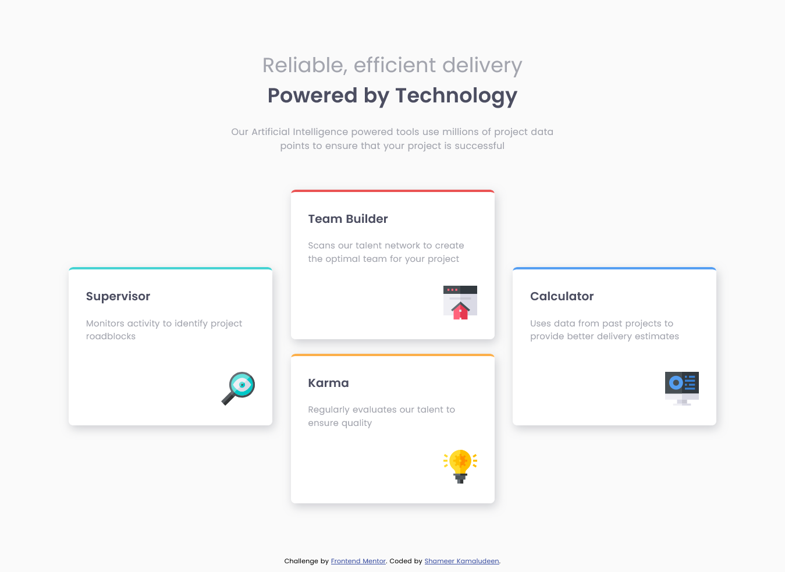

# Frontend Mentor - Four card feature section solution

This is a solution to the [Four card feature section challenge on Frontend Mentor](https://www.frontendmentor.io/challenges/four-card-feature-section-weK1eFYK). Frontend Mentor challenges help you improve your coding skills by building realistic projects. 

## Table of contents

- [Overview](#overview)
  - [The challenge](#the-challenge)
  - [Screenshot](#screenshot)
  - [Links](#links)
- [My process](#my-process)
  - [Built with](#built-with)
  - [What I learned](#what-i-learned)
  - [Continued development](#continued-development)
  - [Useful resources](#useful-resources)
- [Author](#author)
- [Acknowledgments](#acknowledgments)

## Overview

This is the so far for me less stuck in a challenge from Frontend mentor. The knowledge of CSS grid and flexbox help me tackle the challenge easily.

### The challenge

Users should be able to:

- View the optimal layout for the site depending on their device's screen size

### Screenshot

### Links

- [Solution URL](https://github.com/shameerkamaludeen/four-card-feature)
- [Live Site URL](https://shameerkamaludeen.github.io/four-card-feature/)

## My process

### Built with

- Semantic HTML5 markup
- Flexbox
- CSS Grid

### What I learned

Started concentrating on choosing the right structure for the design, which helped me from rewriting the HTML and CSS less, but still need to improve on that.

### Continued development

Want to concentrate on the structuring of HTML more when I see the design itself that may help in changing the CSS less often eventually that may reduce my time on developing the page. 

### Useful resources

Knowing the following helped me achieve the challenge easily.

- [CSS Grids](https://developer.mozilla.org/en-US/docs/Learn/CSS/CSS_layout/Grids)
- [CSS Flexbox](https://developer.mozilla.org/en-US/docs/Learn/CSS/CSS_layout/Flexbox)
- [CSS Flexbox](https://www.w3schools.com/css/css3_flexbox.asp)

## Author

- Github - [Shameer Kamaludeen](https://github.com/shameerkamaludeen)
- Frontend Mentor - [@shameerkamaludeen](https://www.frontendmentor.io/profile/shameerkamaludeen)
- Twitter - [@ShameerKamalud1](https://twitter.com/ShameerKamalud1)

## Acknowledgments

With the help of this challenge Frontend Mentor helped me improve in grasping the structure of the design which gradually decreased the time taken to complete the project. 